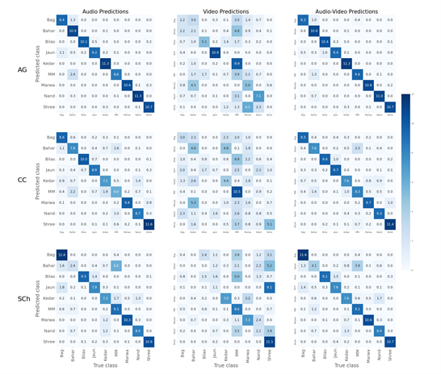
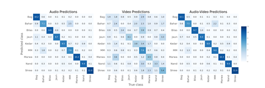

# **Experiments and Results Details**

# Hyperparameter search ranges

The tables below list the ranges over which the individual hyperparameters corresponding to the model types listed in **Table 5** of our paper.

|     **Modality     (Model Type)**    |     **Convolution Layers**              |                         |     **Inception block**           |                      |                     |                       |                                  |     Pooling layer     |
|----------------------------------|-------------------------------------|-------------------------|-------------------------------|----------------------|---------------------|-----------------------|----------------------------------|-----------------------|
|                                  |     # filters                       |     Kernel size         |     Common kernel size (k)    |     # filters        |     Pool size       |     Pooling type      |     Dropout rate                 |     pooling type      |
|     audio (B)                    |     {4, 8, 16, 32, 64, 128, 256}    |     {3, 5, 7, 9, 10}    |     {3, 5, 7, 9, 10}          |     [4, 32]          |     {3, 5}          |     {Max, Average}    |     {0.3, 0.4, 0.5, 0.6, 0.7}    |     {Max, Average}    |
|     video (A)                    |     {16, 32, 64, 128}               |     {3, 5, 7}           |     {3, 5, 7}                 |     [4, 32]          |     {3, 5}          |     {Max, Average}    |     {0.3, 0.4, 0.5, 0.6, 0.7}    |     {Max, Average}    |
|     source fusion (C)            |     {16, 32, 64, 128}               |     {3, 5, 7}           |     {3, 5, 7}                 |     [4, 32]          |     {3, 5}          |     {Max, Average}    |     {0.3, 0.4, 0.5, 0.6, 0.7}    |     {Max, Average}    |

**Table S4a:** Hyperparameter search ranges for the unimodal audio, video and source fusion methods, viz. model types A, B and C in Table 5.

|     **Modality     (Model Type)**    |     **Convolution Layers**              |                         |     **Inception block**           |                      |                     |                       |                                  |     **Pooling layer**     |
|----------------------------------|-------------------------------------|-------------------------|-------------------------------|----------------------|---------------------|-----------------------|----------------------------------|-----------------------|
|                                  |     # filters                       |     Kernel size         |     Common kernel size (k)    |     # filters        |     Pool size       |     Pooling type      |     Dropout rate                 |     pooling type      |
|     audio (B)                    |     {4, 8, 16, 32, 64, 128, 256}    |     {3, 5, 7, 9, 10}    |     {3, 5, 7, 9, 10}          |     [4, 32]          |     {3, 5}          |     {Max, Average}    |     {0.3, 0.4, 0.5, 0.6, 0.7}    |     {Max, Average}    |
|     video (A)                    |     {16, 32, 64, 128}               |     {3, 5, 7}           |     {3, 5, 7}                 |     [4, 32]          |     {3, 5}          |     {Max, Average}    |     {0.3, 0.4, 0.5, 0.6, 0.7}    |     {Max, Average}    |
|     source fusion (C)            |     {16, 32, 64, 128}               |     {3, 5, 7}           |     {3, 5, 7}                 |     [4, 32]          |     {3, 5}          |     {Max, Average}    |     {0.3, 0.4, 0.5, 0.6, 0.7}    |     {Max, Average}    |

**Table S4b:** Hyperparameter search ranges for the latent fusion method, viz. model type D in Table 5.

|     Modality       |     Model                        |     Hyperparameters            |                               |
|--------------------|----------------------------------|--------------------------------|-------------------------------|
|                    |                                  |     Parameter name             |     Parameter values          |
|     Late fusion    | **Logistic regression**          |     Penalty                    |     'l2','l1','elasticnet'    |
|                    |                                  |     Regularization constant    |     0.001-100 in GP of 10     |
|                    | **Random Forest (RF)**           |     Num estimators             |     10,25,50,75,100           |
|                    |                                  |     Max depth                  |     3,5,7                     |
|                    |                                  |     Max features               |     'auto', 'sqrt', 'log2'    |
|                    | **Support Vector Machine (SVM)** |     Regularization constant    |     0.001-100 in GP of 10     |
|                    |                                  |     Kernel                     |     "rbf","linear","poly"     |
|                    |                                  |     Gamma                      |     0.001-100 in GP of 10     |
|                    |                                  |     Polynomial degree          |     2,3                       |
|                    | **XGBoost**                      |     Learning rate              |     0.01,0.05                 |
|                    |                                  |     max_depth                  |     2,4,6                     |
|                    |                                  |     Min_child_weight           |     9,11                      |
|                    |                                  |     subsample                  |     0.7,0.8                   |
|                    |                                  |     colsample_bytree           |     0.7,0.5,0.6               |
|                    |                                  |     n_estimators               |     10-100 in steps of 10     |

**Table S4c:** Hyperparameter search ranges for late fusion method, viz. Model type E1, E2 in Table 5. All models except XGBoost were trained using sklearn and hyperparameter tuning done by grid search cv. XGboost was trained with xgboost package.

Due to space constraints only Random Forest results are mentioned in Table 5 of the paper.

## Tuned hyperparameters

Legend:

The below listed variable names are used in the following tables in this section

1. Conv block
   1. n – Number of filters
   1. k – kernel size
1. Inception block
   Refer to **Figure 3** in the paper for the meaning of each variable name
1. Pooling layer
   1. P – type of pooling

Tuned hyperparameters for video classification task on seen singer split
-------------------------------------------------------------------------

Information of the model and hyperparameters for the **third column (Seen singer, Video) in Table 4**  and **model type A in Table 5** of our paper.

|              | **Model size**         |                            |                             |
|--------------|------------------------|----------------------------|-----------------------------|
|     split    |     # total hparams    |     # trainable hparams    |     Mean model size (MB)    |
|     AG       |     21869              |     21323                  |     0.43                    |
|     CC       |     10333              |     9993                   |     0.29                    |
|     SCh      |     19010              |     18490                  |     0.39                    |

**Table S5A1a:** Size of models used for unimodal video classification on the seen singer split

|              | **Conv block - 1** |          | **Inception block** |            |            |            |            |            |            |          |          |            |            | **Pooling layer** |
|--------------|--------------------|----------|---------------------|------------|------------|------------|------------|------------|------------|----------|----------|------------|------------|-------------------|
|     split    |     n              |     k    |     n11             |     n21    |     n31    |     n32    |     n41    |     n42    |     n43    |     k    |     p    |     P      |     dr     |     P2            |
|     AG       |     128            |     7    |     12              |     32     |     21     |     14     |     25     |     22     |     31     |     7    |     3    |     Max    |     0.3    |     Max           |
|     CC       |     128            |     7    |     10              |     29     |     28     |     24     |     18     |     28     |     31     |     7    |     3    |     Avg    |     0.6    |     Avg           |
|     SCh      |     128            |     7    |     9               |     25     |     10     |     17     |     23     |     27     |     30     |     7    |     3    |     Max    |     0.3    |     Max           |

**Table S5A1b:** Hyperparameters of models used for unimodal video classification on the seen singer split

Tuned hyperparameters for video classification task on unseen singer split
---------------------------------------------------------------------------

Information of the model and hyperparameters for the **fifth column (Unseen singer, Audio) in Table 4** of our paper.

|              | **Model size   **      |                            |                             |
|--------------|------------------------|----------------------------|-----------------------------|
|     split    |     # total hparams    |     # trainable hparams    |     Mean model size (MB)    |
|     AG       |     9479               |     9169                   |     0.28                    |
|     CC       |     16331              |     15871                  |     0.36                    |
|     SCh      |     5957               |     5721                   |     0.24                    |

**Table S5A2a:** Size of models used for unimodal video classification on the unseen singer split

|              | **Conv block - 1** |          | **Inception block** |            |            |            |            |            |            |          |          |            |            | **Pooling layer** |
|--------------|--------------------|----------|---------------------|------------|------------|------------|------------|------------|------------|----------|----------|------------|------------|-------------------|
|     split    |     n              |     k    |     n11             |     n21    |     n31    |     n32    |     n41    |     n42    |     n43    |     k    |     p    |     P      |     dr     |     P2            |
|     AG       |     16             |     7    |     21              |     9      |     32     |     20     |     16     |     30     |     32     |     5    |     5    |     Max    |     0.7    |     Avg           |
|     CC       |     128            |     5    |     22              |     11     |     9      |     28     |     31     |     17     |     6      |     3    |     3    |     Max    |     0.6    |     Avg           |
|     SCh      |     16             |     7    |     18              |     5      |     26     |     15     |     22     |     19     |     15     |     5    |     3    |     Avg    |     0.5    |     Avg           |

**Table S5A2b:** Hyperparameters of models used for unimodal video classification on the unseen singer split

Tuned hyperparameters for audio classification task on seen singer split
-------------------------------------------------------------------------

Information of the model and hyperparameters for the **second column (Seen singer, Audio) in Table 4**  and **model type B in Table 5** of our paper.

|              | **Model size**         |                            |                             |
|--------------|------------------------|----------------------------|-----------------------------|
|     split    |     # total hparams    |     # trainable hparams    |     Mean model size (MB)    |
|     AG       |     69903              |     69067                  |     1                       |
|     CC       |     43323              |     42761                  |     0.7                     |
|     SCh      |     189136             |     188300                 |     2.5                     |

**Table S5B1a:** Size of models used for unimodal audio classification on the seen singer split

|              | **Conv block - 1** |          | **Conv block - 2** |           | **Inception block** |            |            |            |            |            |            |           |          |            |            | **Pooling layer** |
|--------------|--------------------|----------|--------------------|-----------|---------------------|------------|------------|------------|------------|------------|------------|-----------|----------|------------|------------|-------------------|
|     split    |     n              |     k    |     n              |     k     |     n11             |     n21    |     n31    |     n32    |     n41    |     n42    |     n43    |     k     |     p    |     P      |     dr     |     P2            |
|     AG       |     16             |     5    |     256            |     9     |     24              |     28     |     27     |     22     |     17     |     32     |     20     |     10    |     5    |     Avg    |     0.5    |     Avg           |
|     CC       |     32             |     7    |     128            |     7     |     19              |     14     |     10     |     28     |     24     |     16     |     29     |     3     |     5    |     Avg    |     0.4    |     Avg           |
|     SCh      |     128            |     9    |     128            |     10    |     24              |     28     |     27     |     26     |     28     |     24     |     29     |     3     |     3    |     Max    |     0.5    |     Avg           |

**Table S5B1b:** Hyperparameters of models used for unimodal audio classification on the seen singer split

Tuned hyperparameters for audio classification task on unseen singer split
---------------------------------------------------------------------------

Information of the model and hyperparameters for the **fourth column (Unseen singer, Audio) in Table 4.**

|              | **Model size**         |                            |                             |
|--------------|------------------------|----------------------------|-----------------------------|
|     split    |     # total hparams    |     # trainable hparams    |     Mean model size (MB)    |
|     AG       |     18698              |     18244                  |     0.41                    |
|     CC       |     9773               |     9431                   |     0.3                     |
|     SCh      |     20298              |     19790                  |     0.43                    |

**Table S5B2a:** Size of models used for unimodal audio classification on the unseen singer split

|              | **Conv block - 1** |          | **Conv block - 2** |          | **Inception block** |            |            |            |            |            |            |           |          |            |            | **Pooling layer** |
|--------------|--------------------|----------|--------------------|----------|---------------------|------------|------------|------------|------------|------------|------------|-----------|----------|------------|------------|-------------------|
|     split    |     n              |     k    |     n              |     k    |     n11             |     n21    |     n31    |     n32    |     n41    |     n42    |     n43    |     k     |     p    |     P      |     dr     |     P2            |
|     AG       |     8              |     3    |     64             |     7    |     27              |     32     |     31     |     32     |     32     |     17     |     11     |     10    |     5    |     Avg    |     0.6    |     Avg           |
|     CC       |     32             |     3    |     8              |     9    |     11              |     12     |     32     |     15     |     20     |     32     |     20     |     5     |     5    |     Avg    |     0.6    |     Avg           |
|     SCh      |     8              |     9    |     128            |     5    |     24              |     7      |     30     |     32     |     5      |     30     |     14     |     10    |     5    |     Max    |     0.3    |     Avg           |

**Table S5B2b:** Size of models used for unimodal audio classification on the unseen singer split

Tuned hyperparameters for early fusion classification
------------------------------------------------------

Information of the model and hyperparameters for **model type C in Table 5** of our paper.

|              | **Model size**         |                            |                             |
|--------------|------------------------|----------------------------|-----------------------------|
|     split    |     # total hparams    |     # trainable hparams    |     Mean model size (MB)    |
|     AG       |     22341              |     21815                  |     0.43                    |
|     CC       |     21570              |     21044                  |     0.42                    |
|     SCh      |     23397              |     22879                  |     0.45                    |

**Table S5Ca:** Size of models used for source fusion multimodal classification on the seen singer split

|              | **Conv block - 1** |          | **Inception block** |            |            |            |            |            |            |          |          |            |            | **Pooling layer** |
|--------------|--------------------|----------|---------------------|------------|------------|------------|------------|------------|------------|----------|----------|------------|------------|-------------------|
|     split    |     n              |     k    |     n11             |     n21    |     n31    |     n32    |     n41    |     n42    |     n43    |     k    |     p    |     P      |     dr     |     P2            |
|     AG       |     128            |     7    |     14              |     22     |     10     |     27     |     32     |     30     |     14     |     3    |     3    |     Avg    |     0.5    |     Avg           |
|     CC       |     128            |     3    |     21              |     14     |     25     |     6      |     28     |     32     |     30     |     7    |     3    |     Max    |     0.5    |     Avg           |
|     SCh      |     128            |     7    |     24              |     21     |     27     |     30     |     17     |     24     |     12     |     7    |     5    |     Max    |     0.5    |     Avg           |

**Table S5Cb:** Hyperparameters of models used for source fusion multimodal classification on the seen singer split

Tuned hyperparameters for latent fusion classification
------------------------------------------------------

Information of the model and hyperparameters for **model type D in Table 5** of our paper.

|              | **Model size**         |                            |                             |
|--------------|------------------------|----------------------------|-----------------------------|
|     split    |     # total hparams    |     # trainable hparams    |     Mean model size (MB)    |
|     AG       |     108876             |     65738                  |     1.2                     |
|     CC       |     88934              |     54230                  |     0.99                    |
|     SCh      |     220897             |     48761                  |     1.5                     |

**Table S5Da:** Size of models used for latent fusion multimodal classification on the seen singer split

|              | **Pooling + 1D convolution*** |                        |            | **Inception block** |            |            |            |            |            |            |          |          |            |            | **Pooling layer** |
|--------------|-------------------------------|------------------------|------------|---------------------|------------|------------|------------|------------|------------|------------|----------|----------|------------|------------|-------------------|
|     split    |     Audio Pool type           |     Video Pool type    |     n      |     n11             |     n21    |     n31    |     n32    |     n41    |     n42    |     n43    |     k    |     p    |     P      |     dr     |     P2            |
|     AG       |     Max                       |     Max                |     128    |     26              |     22     |     12     |     31     |     21     |     22     |     29     |     3    |     5    |     Avg    |     0.4    |     Avg           |
|     CC       |     Max                       |     Max                |     128    |     24              |     18     |     31     |     13     |     29     |     32     |     29     |     5    |     3    |     Max    |     0.6    |     Avg           |
|     SCh      |     Avg                       |     Avg                |     128    |     23              |     8      |     26     |     19     |     23     |     29     |     11     |     7    |     5    |     Avg    |     0.4    |     Avg           |

**Table S5Db:** Hyperparameters of models used for latent fusion multimodal classification on the seen singer split

\* Pooling is done on the audio and video conv layer outputs separately to make them the same length to allow for their depth wise concatenation. 1D convolution is then used on the output of the audio and video conv blocks to reduce the size of the data going into the inception block.

Tuned hyperparameters for Late fusion
--------------------------------------

| **Split**  | **Model**            | **Hyperparameter name** |                  |                     |
|------------|----------------------|-------------------------|------------------|---------------------|
|            |                      |     Num_Estimators      |     Max_depth    |     Max_features    |
|     AG     |     Random forest    |     50                  |     7            |     ‘sqrt’          |
|     CC     |     Random forest    |     75                  |     5            |     ‘sqrt’          |
|     SCh    |     Random forest    |     50                  |     7            |     ‘sqrt’          |

**Table S5E:** Hyperparameters of models used for late fusion multimodal classification on the seen singer split

# Confusion matrices of the results

**Figure S3 (a):** Confusion matrices of predictions made from audio, video and audio-video modalities. Numbers are represented as percentages of the total number of samples shown in the matrix. The rows indicate the train-val split from which the validation data was used to generate the confusion matrix i.e. AG, CC, SCh data splits in the ‘seen split‘ case. The columns indicate unimodal audio, unimodal video and multimodal (corresponding to latent fusion - model D in Table 5 of the paper) models. Fig 5 in the paper (same as Figure S3 (b) below) is derived from this figure by combining the predictions across all 3 data splits.

**Figure S3 (b):** Confusion matrices of predictions made from audio, video and audio-video modalities. Numbers are represented in percentages of the total number of test examples across the three singers combined. Same as Figure 5 in the paper.

